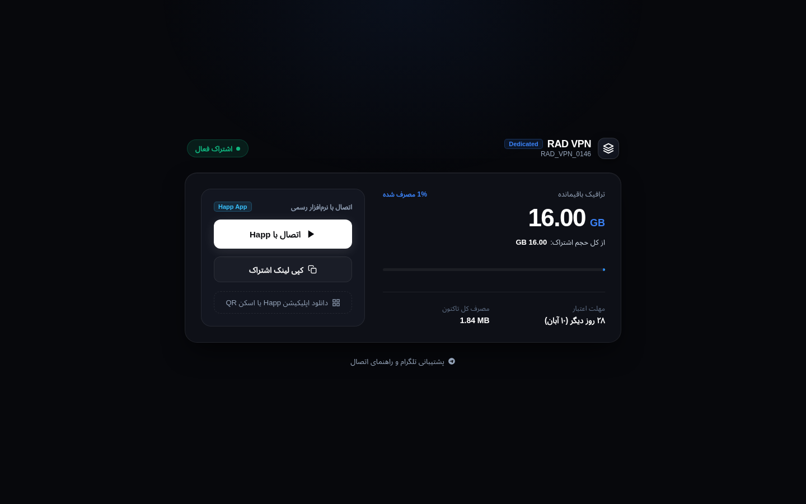
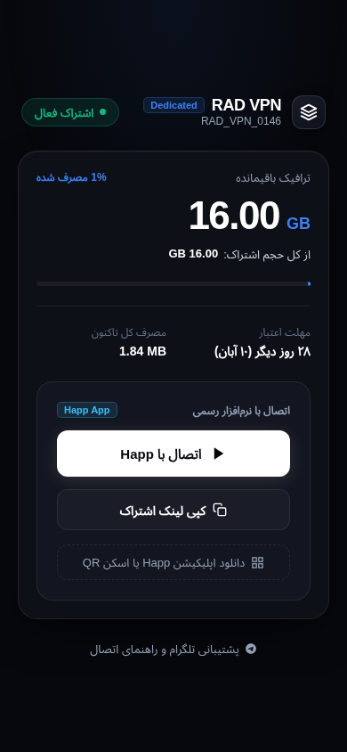

# 3x-ui Obsidian Subscription Theme

[](https://github.com/mrVXBoT/3x-ui-subscription-theme/releases)
[](LICENSE)
[](https://github.com/MHSanaei/3x-ui)
[](https://github.com/happ-proxy/happ)
[](https://github.com)

A minimalist, high-performance subscription theme designed for [3x-ui](https://github.com/MHSanaei/3x-ui) panels. Engineered around the **Happ Proxy** ecosystem with quiet luxury aesthetics inspired by modern developer products (Linear, Proton, Tailscale).

---

## Previews

<div align="center">
  
  <p><em>Desktop Layout (Dual-Column 780px Architecture)</em></p>
  <br/>
  
  <p><em>Mobile Layout (Compact 390px Viewport)</em></p>
</div>

---

## Highlights

- **Dedicated Happ Proxy Integration**: Direct 1-click subscription import scheme (`happ://add/<subUrl>`) alongside official download links for iOS, macOS, Android, and Windows.
- **Engineered Hierarchy**: Dual-column 780px layout on desktop prevents empty white space, transforming into an ultra-compact single-column card on mobile devices.
- **Adaptive Unlimited Plan Logic**: Cleanly detects unlimited packages, automatically hiding obsolete progress bars and the confusing "∞" symbols, putting "نامحدود" front and center while displaying actual consumption secondarily.
- **Subtle QR Sheet**: Replaces jarring white QR blocks with an on-demand modal overlay, preserving dark-mode visual comfort.
- **Bidirectional Typography**: Vazirmatn Persian RTL layout paired with Inter for isolated LTR numeric values (`GB`, `MB`, durations).
- **Pure Native & Lightweight**: Zero frontend frameworks, zero runtime dependencies, zero external tracking scripts, and minimal footprint.
- **Enterprise-Grade Shell Installer**: 100% POSIX/Bash compatibility with automated database configuration, zero emoji distractions, and safe snapshot backups.

---

## Quick Install (One-Liner)

Log in to your 3x-ui Linux server via SSH and execute:

```bash
bash <(curl -fsSL https://raw.githubusercontent.com/mrVXBoT/3x-ui-subscription-theme/main/install.sh)
```

The installer will automatically detect your 3x-ui environment, back up your current subscription template, configure `subThemeDir`, and reload the service.

---

## CLI Options

The `install.sh` script supports direct CLI flags for non-interactive and scripted environments:

```bash
# Direct Installation
sudo bash install.sh --install

# Restore Original 3x-ui Template
sudo bash install.sh --restore

# Create a Timestamped Backup
sudo bash install.sh --backup

# Inspect Service & Theme Status
bash install.sh --status
```

---

## Manual Installation

If you prefer not to use the automated script:

1. Clone or download this repository onto your server:
   ```bash
   git clone https://github.com/mrVXBoT/3x-ui-subscription-theme.git
   ```

2. Create the custom template directory:
   ```bash
   sudo mkdir -p /etc/x-ui/sub
   ```

3. Copy the production theme template:
   ```bash
   sudo cp theme/index.html /etc/x-ui/sub/index.html
   ```

4. Configure 3x-ui database to read from the custom directory:
   ```bash
   sqlite3 /etc/x-ui/x-ui.db "INSERT INTO settings (key, value) VALUES ('subThemeDir', '/etc/x-ui/sub') ON CONFLICT(key) DO UPDATE SET value='/etc/x-ui/sub';"
   ```

5. Restart the 3x-ui daemon:
   ```bash
   sudo systemctl restart x-ui
   ```

---

## Offline Preview

You can inspect the client-side design and responsiveness without running a 3x-ui server. Simply open `preview/index.html` in any modern web browser or run:

```bash
python3 -m http.server 8080 --directory preview
```

---

## راهنمای فارسی (Persian Summary)

قالب مدرن و مینیمال برای صفحه اشتراک پنل‌های **3x-ui** که با تمرکز ویژه بر کلاینت **Happ Proxy** طراحی شده است.

### ویژگی‌های کلیدی:
* **اتصال تک‌کلیک به Happ**: باز شدن مستقیم اشتراک در برنامه با پروتکل اختصاصی.
* **طراحی واکنش‌گرا (Responsive)**: لایه بهینه دو ستونه دسکتاپ (۷۸۰ پیکسل) و طراحی بسیار جمع‌وجور برای موبایل.
* **پشتیبانی هوشمند از پلن‌های نامحدود**: حذف نوارهای پیشرفت بیهوده و اعداد بی‌نهایت، نمایش برجسته عنوان «نامحدود».
* **کد QR در پنجره شناور**: پنهان‌سازی کادر سفید QR تا زمان نیاز، جهت حفظ ارگونومی دارک‌مود.
* **اسکریپت نصب تمیز و بدون وابستگی**: سازگار با تمامی توزیع‌های لینوکس بدون نیاز به پایتون یا پکیج‌های اضافی.

برای نصب سریع، دستور زیر را در ترمینال سرور اجرا کنید:
```bash
bash <(curl -fsSL https://raw.githubusercontent.com/mrVXBoT/3x-ui-subscription-theme/main/install.sh)
```

---

## License

Released under the [MIT License](LICENSE). Built for the privacy community.
